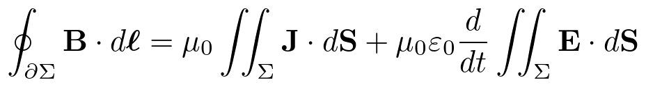
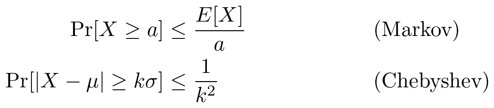
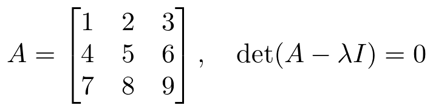

# texcat

**Real LaTeX rendering, straight into your terminal.** Not Unicode approximations — actual TeX: Computer Modern, true math layout, the same engine Overleaf runs. `cat` for math.

```
texcat '\oint_{\partial \Sigma} \mathbf{B} \cdot d\boldsymbol{\ell} = \mu_0 \iint_{\Sigma} \mathbf{J} \cdot d\mathbf{S} + \mu_0 \varepsilon_0 \frac{d}{dt} \iint_{\Sigma} \mathbf{E} \cdot d\mathbf{S}'
```



Matrices, `align` with annotations, `cases`, `\pmod` — anything TeX can typeset, because it *is* TeX:





## How it works

```
LaTeX ──▶ latex (DVI) ──▶ dvipng ──▶ PNG ──▶ Kitty / iTerm2 graphics protocol
                                              │
                                              └─ no graphics support?
                                                 Unicode-art fallback (TeXicode / sympy)
```

Renders are cached (`~/.cache/texcat`), so repeated expressions are instant.

## Terminal support

| Terminal | Protocol | Result |
|---|---|---|
| Ghostty, Kitty, WezTerm | Kitty graphics | pixel-perfect TeX |
| iTerm2 | OSC 1337 inline images | pixel-perfect TeX |
| anything else (incl. SSH, plain TTYs, agent harnesses) | — | Unicode art fallback |

## Install

```bash
pipx install git+https://github.com/a-hiremath/texcat
```

Requirements:

- **A TeX distribution** providing `latex` + `dvipng` (macOS: [MacTeX](https://www.tug.org/mactex/), Linux: `texlive` + `dvipng` packages). Without it, texcat still works in Unicode-fallback mode.
- **Pillow** (optional but recommended — used to crop renders tight).
- For the best Unicode fallback: `pipx inject texcat TeXicode sympy antlr4-python3-runtime==4.11` (or `pip install "texcat[unicode]"`).

## Usage

```bash
# display-style math, auto theme (matches your terminal background)
texcat '\int_0^\infty e^{-x^2}\,dx = \frac{\sqrt{\pi}}{2}'

# pipe from anywhere — no shell-quoting headaches with primes
echo "f'(x) = \lim_{h\to 0} \frac{f(x+h)-f(x)}{h}" | texcat

# themes: auto (default), card (black-on-white), dark / light (transparent bg)
texcat -t card '\nabla \times \mathbf{E} = -\frac{\partial \mathbf{B}}{\partial t}'

# bigger render
texcat -d 400 'e^{i\pi} + 1 = 0'

# force the Unicode tier (works over SSH, in scripts, anywhere)
texcat -u 'a^{p-1} \equiv 1 \pmod{p}'
#  𝑎ᵖ⁻¹≡1 (mod 𝑝)

# save instead of display
texcat -o eq.png 'x = \frac{-b \pm \sqrt{b^2-4ac}}{2a}'

# open in the system image viewer
texcat --open '\begin{align*} a &= b \\ &= c \end{align*}'
```

## Live viewer — pixel math beside your AI agent

TUI apps repaint their screens, and their subprocesses often have **no TTY at all** — so inline graphics can't survive *inside* an AI coding agent like Claude Code. The viewer sidesteps that: keep a tiny `texcat --listen` window next to your session, and anything can push equations into it through a feed file. The viewer owns a real TTY with graphics support, so every push renders as genuine typeset TeX the instant it lands.

```bash
texcat --viewer                      # opens a new terminal window running the viewer (macOS)
# ...or run `texcat --listen` yourself in any spare split/window

texcat --send 'e^{i\pi} + 1 = 0'     # from anywhere — your agent, a script, vim — renders instantly
```

Tell your AI agent to `texcat --send` its display math and you get an Overleaf-quality math sidebar for your conversation. Renders are logged to `~/.cache/texcat/viewer.log`, so even a headless agent can verify its math actually displayed.

## Math-native Claude (or any LLM CLI)

Interactive Claude Code is a TUI — it owns and repaints the screen, so inline images can't live *inside* it (use the [HUD](#hud--float-math-over-a-tui) or the [viewer](#live-viewer--pixel-math-beside-your-ai-agent) there). But **headless mode has no TUI**: output just flows into your scrollback, which is exactly where inline images are stable. Pipe it through texcat and every `$$…$$` block in the answer becomes real typeset math:

```bash
mathclaude() { claude -p --continue "$*" | texcat -f -; }

mathclaude "derive the closed form for the sum of the first n squares"
```

Prose comes through as text; display math lands as Overleaf-grade pixels, inline, permanently. Works with any CLI that emits markdown math.

## HUD — float math over a TUI

`texcat --hud '<latex>'` renders the equation and floats it over the **top-right of the terminal this session lives in** — even when invoked from a TTY-less subprocess (agent harness, make, launchd): it finds the session's pty through process ancestry and places a z-topped, cursor-neutral overlay that survives the host TUI's repaints. `--hud-clear` removes it; each new `--hud` replaces the last.

## Why not just Unicode art?

Unicode math renderers (we love [TeXicode](https://github.com/dxddxx/TeXicode), and use it as our fallback tier) are great for simple expressions, but they hit a ceiling: matrices, multi-line alignments, radicals over fractions, struts and spacing — a character grid can only do so much. Modern terminals can draw pixels. If your terminal can show a picture, it can show *real typeset math*.

## Theme behavior

`--theme auto` queries your terminal's actual background color (OSC 11) and renders transparent-background math with ink that matches your theme — light text on dark terminals, dark text on light ones. If the query fails, it falls back to `card` (black-on-white), which is legible everywhere.

## Roadmap

- [ ] PyPI release
- [ ] Markdown mode: render every `$$...$$` block in a file (`texcat -f notes.md`)
- [ ] Sixel backend (older terminals)
- [ ] Font size in terminal-cell units (`--cols 40`)
- [ ] Linux support for `--viewer` (the `--listen`/`--send` pair is already portable)

## Contributing

Issues and PRs very welcome — this project wants co-maintainers. The whole tool is one file: [`texcat/cli.py`](texcat/cli.py).

## Credits

- [preview-latex / standalone](https://ctan.org/pkg/standalone) and [dvipng](https://ctan.org/pkg/dvipng) do the heavy lifting.
- [TeXicode](https://github.com/dxddxx/TeXicode) and [sympy](https://www.sympy.org/) power the Unicode fallback tier.

MIT © 2026 Adi Hiremath
